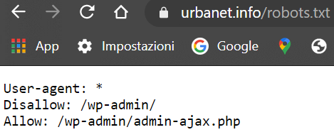

```{r setup, include=FALSE}
knitr::opts_chunk$set(echo = TRUE)
```

## Abstract

This project aims at collecting information about the discourse above smart cities: I will, first of all, by interacting with the Twitter API, collect and analyze the latest Tweets about smart cities, trying to analyze and discover whether the sentiment related to this debate is positive or negative, which are the most used words and what are the most discussed topics related to it. I will then focus on India, since it provides, on the one hand, clear example of one the most advanced smart cities policy in the world, while, on the other hand, representing a sensitive case etc

more things to say

trying to add one beautiful image

{width="301"}

YEY \<3
